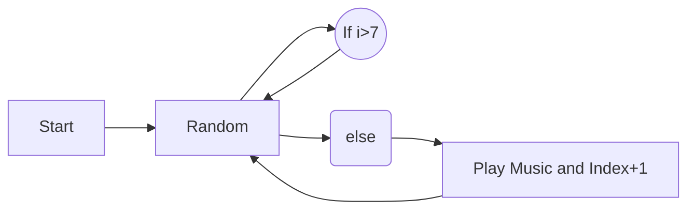

# Tiles
**Task 3** : Tiles and Wave!
**Robovitics** - The official Robotics Club of VIT

> by [Henit Chobisa](https://github.com/henit)

 - The problem is to create a matrix of order n where each (row, column) is a tile, the order n has
to be taken from the user and the outliers should be taken care by the developer, this means
that the developer has to set a minimum size of each tile and if the order exceeds the height
or the width of the window, then you have to show the maximum tiles that can fit in the
window.

 - Each tile is meant to play one of the sound from “do, re, mi, fa….” on mouse hover satisfying
the following conditions :
In the beginning the site should play any note from the eight musical notes.
If the last played note has an index i ( i ≠ 0 && i ≠ 7 ) then the note which should be played
must have index between i + 1 to 7, including i + 1 and 7.

 - If the last played note has an index 7, the next note can be picked from any of the 0 to 7
indices.

## Flow Chart

